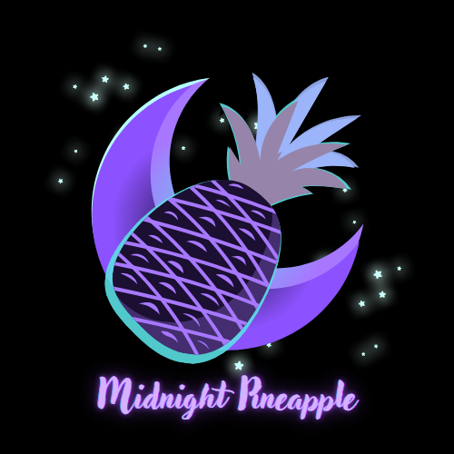

#Fruit Of the Witch

<table>
<tr>
<td width="350">

</td>

<td>

Fruit of the Witch is a 2D combat-adventure game where players explore mysterious environments, engage in strategic combat, and search for hidden magical fruits.

In a dark forest ruled by a powerful witch, a magical pineapple holds the power to break a deadly curse. After the witch kidnaps his sister, a brave hero must sneak into her house, escape through the jungle, and face her in a final battle. Only one will survive, and the fate of his sister depends on it.

</td>
</tr>
</table>
---

#Gantt chart
[Gantt Timeline Link](https://vandalsuidaho-my.sharepoint.com/:x:/g/personal/brek3306_vandals_uidaho_edu/IQA-WxhcJmHHSbnkV6Ah_ch0AfUllPKvCS2JVRodhSHY5hM?e=HUNUD9)

